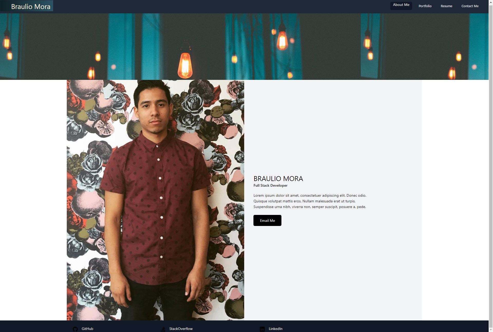
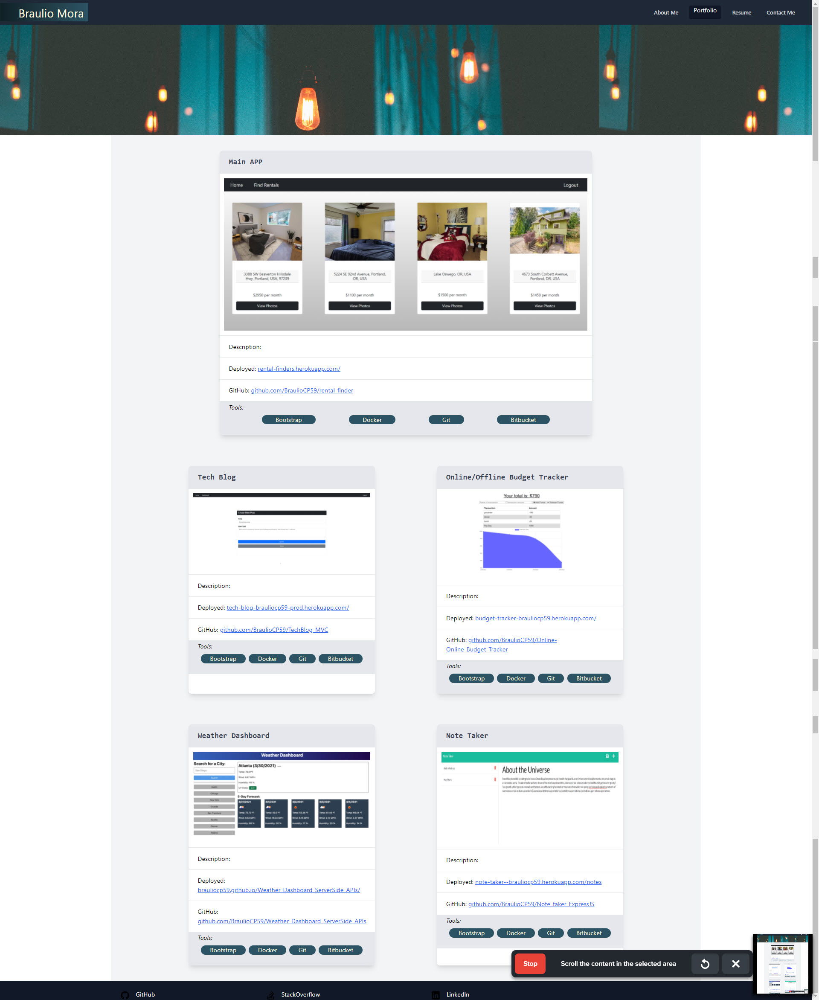

# 20 React: React Portfolio

Being a web developer means being part of a community. I created this site as a place not only to share my projects while applying for jobs or working as a freelancer but also to share my work with other developers and collaborate on projects.

I have created this portfolio using new React skills, which i believe will help set me apart becuase it uses some of the latest technologies.

## Deployment
https://braulio-mora-react-portfolio.netlify.app/#Portfolio

## About Me

## Portfolio
